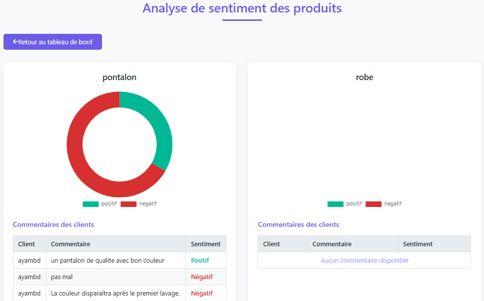

# 🛒 Intelligent E-commerce Platform with NLP Sentiment Analysis

## 📌 Project Overview

This project is an intelligent e-commerce platform developed using **Symfony**, **FastAPI**, and **Natural Language Processing (NLP)** technologies.

The platform allows:

- Clients to browse and purchase products
- Vendors to manage their products
- Customers to leave comments and reviews
- Automatic sentiment analysis of customer comments using AI
- Vendors and administrators to visualize product statistics and customer satisfaction

The project combines:

- Web Development
- Artificial Intelligence

---

# 🎯 Main Objective

The main objective of this project is to integrate **Artificial Intelligence** into an e-commerce platform in order to automatically analyze customer opinions and transform them into useful business insights.

Instead of manually reading all comments, the system can automatically determine whether customer feedback is:

- Positive 😊
- Negative 😡
- Neutral 😐

This helps vendors:

- Improve product quality
- Understand customer satisfaction
- Detect negative reviews quickly
- Make better business decisions

---

# ✨ Custom Development

This project was fully developed **from scratch** without using prebuilt e-commerce templates.

The entire architecture, business logic, dashboards, and NLP integration were manually designed and implemented.

The project includes:

- Custom Symfony controllers
- Custom Doctrine entities
- FastAPI microservice integration
- NLP sentiment analysis workflow
- Dynamic vendor statistics dashboards
- Custom Twig interfaces
- Role-based authentication system
- Comment moderation system
- Custom CSS styling and responsive UI

The communication between Symfony and FastAPI was entirely implemented manually.

---

# 🧠 NLP Integration

The NLP service is developed using:

- FastAPI
- HuggingFace Transformers
- DistilBERT model

Model used:

```text
distilbert-base-uncased-finetuned-sst-2-english
```
---
# ⚙️ Technologies Used

### Backend

* Symfony 7
* PHP 8
* Doctrine ORM
* MySQL

### AI / NLP

* Python
* FastAPI
* Transformers
* HuggingFace
* DistilBERT

### Frontend

* Twig
* Bootstrap
* HTML
* CSS
* JavaScript
* Chart.js

---

# 🏗️ System Architecture

```text
Client Comment
      ↓
Symfony Controller
      ↓
FastAPI NLP Service
      ↓
DistilBERT Sentiment Analysis
      ↓
Database Storage
      ↓
Vendor Statistics Dashboard
```

---

# 🚀 Installation Guide

## 1️⃣ Clone Repository

```bash
git clone https://github.com/Mouabbad/ecommerce-nlp-pfe.git
cd ecommerce-nlp-pfe
```

---

# 🐘 Symfony Installation

## 2️⃣ Access Symfony Project

```bash
cd ecommercePrj
```

---

## 3️⃣ Install Composer Dependencies

```bash
composer install
```

---

## 4️⃣ Configure Database

Edit `.env` file:

```env
DATABASE_URL="mysql://root:@127.0.0.1:3306/ecommerce_db"
```

---

## 5️⃣ Create Database

```bash
php bin/console doctrine:database:create
```

---

## 6️⃣ Run Doctrine Migrations

```bash
php bin/console doctrine:migrations:migrate
```

---

## 7️⃣ Start Symfony Server

```bash
symfony server:start
```

Symfony server:

```text
http://127.0.0.1:8000
```

---

# 🐍 FastAPI NLP Installation

## 1️⃣ Access NLP Service

```bash
cd analyze-sent
```

---

## 2️⃣ Create Virtual Environment

```bash
python -m venv venv
```

---

## 3️⃣ Activate Virtual Environment

### Windows

```bash
venv\Scripts\activate
```

### Linux / Mac

```bash
source venv/bin/activate
```

---

## 4️⃣ Install Python Dependencies

```bash
pip install fastapi uvicorn transformers torch
```

---

## 5️⃣ Start FastAPI Server

```bash
uvicorn main:app --reload
```
---

## ⚠️ Important Note: Running the FastAPI Server

**Before adding any comments or reviews to the platform, ensure that the FastAPI NLP server is running.**

The FastAPI server must be active to:
- Process customer comments
- Perform sentiment analysis using DistilBERT
- Return sentiment results to the Symfony application

If the FastAPI server is not running, comment submission will fail or sentiment analysis will not be performed.

**Steps to ensure FastAPI is running:**
1. Open a new terminal/command prompt
2. Navigate to the `analyze-sent` directory
3. Activate the virtual environment (see section 3️⃣ above)
4. Start the FastAPI server with: `uvicorn main:app --reload`
5. Verify the server is running at `http://127.0.0.1:8001`

---

# 🔥 Importance of NLP in E-commerce

Natural Language Processing allows companies to automatically understand customer opinions.

Instead of manually reading thousands of reviews, the system can:

- Detect customer satisfaction
- Identify negative experiences
- Improve product quality
- Help vendors make better decisions
- Monitor customer sentiment automatically

This transforms raw customer comments into valuable business intelligence.

---

# 📈 Future Improvements

Possible future improvements:

- Multi-language sentiment analysis
- Recommendation system
- Real-time analytics
- Deep learning custom model training
- Advanced admin analytics
- Product recommendation AI

---

# 🖼️ Screenshots

## 🏠 Admin dashboard

.png)
.png)
.png)
## 💬 Comment Page


## 📊 Vendor Dashboard

.png)

## 📊 Vendor statisrics



---

# 👨‍💻 Author

Developed by: **Aya Mouabbad**

Final Year Project (PFE)

---

# 📄 License

This project was developed for educational and academic purposes.
